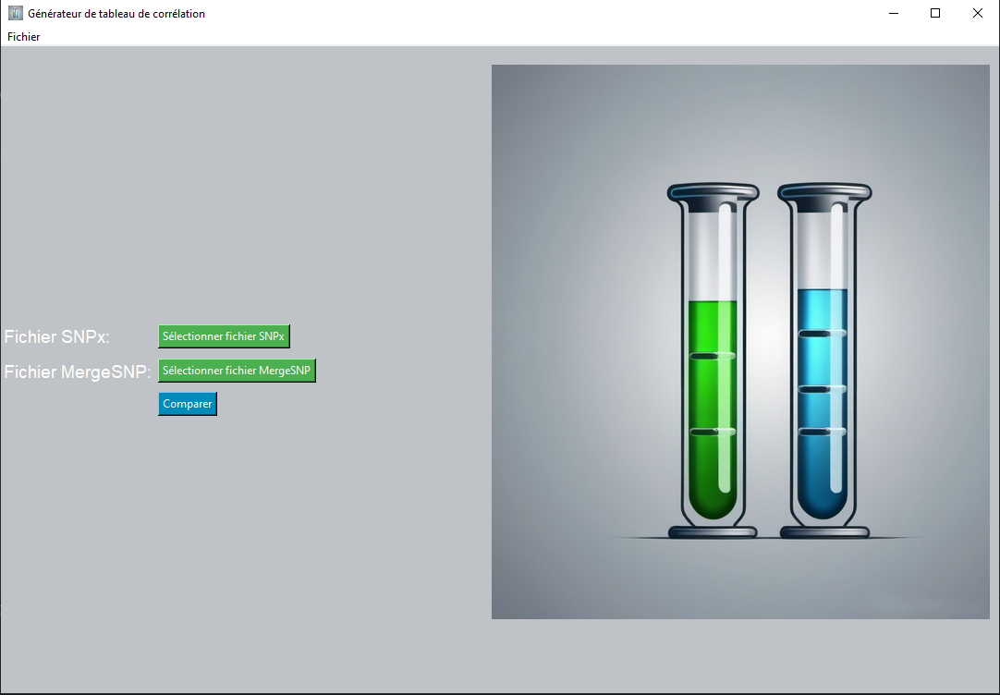
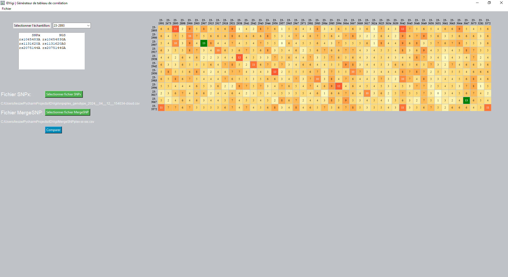

# IDVigi : Documentation

    

## Aperçu
Le programme IDVigi est un programme de vérification d'itentité basé sur la comparaison de résultats de génotypage de SNPs.  
Les recommandations de bonnes pratiques de séquençage haut débit s'accordent sur la nécessité de disposer d'une technique de vérification d'identité, basée sur la comparaison des génotypes de plusieurs polymorphismes, les génotypes étant obtenus de manière indépendante par séquençage haut débit (next generation sequencing, NGS) et par une seconde technique, comme la PCR multiplex fluorescente spécifique à l'allèle.
IDVigi permet d'évaluer la concordance des typages entre différents échantillons en se basant sur un nombre sélectionné de SNPs. Le programme compare les données entre deux fichiers d'entrée et génère une représentation graphique illustrant le nombre de SNPs partagés entre les échantillons. 

    
    

## Fichiers

### `app.py`
Ce fichier sert de point d'entrée au programme. Il importe les modules nécessaires et définit la fonction principale `principale()` responsable de lancer le processus de comparaison SNP.

### `generation.py`
Ce module gère les composants de l'interface utilisateur graphique (GUI) du programme en utilisant Tkinter. Il permet aux utilisateurs de sélectionner des fichiers d'entrée via une boîte de dialogue de fichier, affiche les chemins des fichiers sélectionnés et déclenche l'exécution de la fonction principale de comparaison SNP. De plus, il contient des fonctions pour mettre à jour les images du canevas et exécuter la fonction principale.

### `main.py`
Ce module contient la fonctionnalité principale du programme. Il définit la fonction `creerCarteIdVigi()` qui effectue la comparaison SNP. Cette fonction lit les données SNP à partir de fichiers d'entrée, traite les données pour identifier les SNPs partagés entre les échantillons, génère une représentation graphique et enregistre le résultat sous forme de fichier image.

## Fonctionnalités

### Fonction Principale (`creerCarteIdVigi(chemSNPx, chemMergeSNP)`)
- Lit les données SNP à partir de deux fichiers d'entrée (`chemSNPx` et `chemMergeSNP`).
- Traite les données SNP pour extraire le génotypage et calculer la concordance entre les échantillons en fonction des SNPs partagés.
- Génère une représentation graphique de la concordance SNP à l'aide d'un tableau comportant un gradient coloré selon le nombre de SNPs en commun.
- Enregistre la représentation graphique sous forme de fichier image.

### Interface GUI
- Fournit une interface conviviale pour sélectionner les fichiers d'entrée.
- Affiche les chemins des fichiers sélectionnés pour vérification.
- Permet aux utilisateurs de déclencher le processus de comparaison SNP.

## Comment Utiliser
##### **Deux fichiers de test sont fournis dans le package d'installation. *MergeSNPplex-xx-xxx.csv* comporte les résulats de séquençage NGS et *snpxplex_genotype_2024__04__12__154034-cloud.csv* contient les génotypages obtenus par la technique SNPXPlex**
1. Lancer le programme en exécutant `app.py`.
2. Utiliser l'interface GUI pour sélectionner les fichiers SNP (`SNPx` et `MergeSNP`) en cliquant sur les boutons respectifs.
3. Une fois les deux fichiers sélectionnés, cliquer sur le bouton "Comparer" pour lancer le processus de comparaison SNP.
4. Le programme traitera les fichiers d'entrée et générera une représentation graphique illustrant la concordance SNP.
5. Le fichier image résultant (`tableau_final.png`) sera affiché dans l'interface GUI.

## Dépendances
- Python 3.x
- Pandas
- NumPy
- Tkinter (pour GUI)
- PIL (Python Imaging Library)
- html2image

## Remarque
- S'assurer que toutes les dépendances requises sont installées avant d'exécuter le programme.- Le programme suppose que les fichiers d'entrée sont dans un format spécifique **(.csv)** compatible avec le code fourni.

Cette documentation fournit un aperçu du programme IDVigi, de ses fonctionnalités et de son utilisation. Pour toute assistance supplémentaire ou toute question, ,n'hésitez pas à me contacter. 
