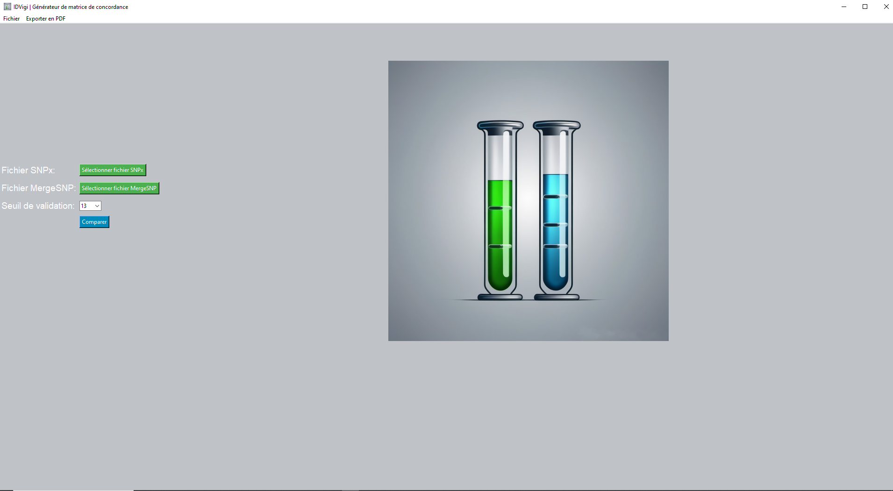
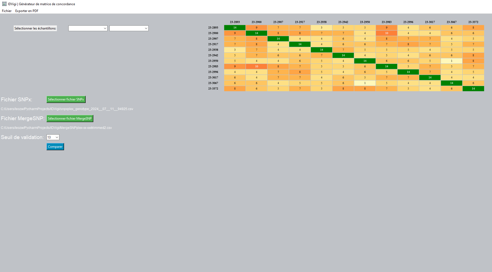

# IDVigi : Documentation

    

## Aperçu
Le programme IDVigi est un programme de vérification d'itentité basé sur la comparaison de résultats de génotypage de SNPs.  
Les recommandations de bonnes pratiques de séquençage haut débit s'accordent sur la nécessité de disposer d'une technique de vérification d'identité, basée sur la comparaison des génotypes de plusieurs polymorphismes, les génotypes étant obtenus de manière indépendante par séquençage haut débit (next generation sequencing, NGS) et par une seconde technique, comme la PCR multiplex fluorescente spécifique à l'allèle.
IDVigi permet d'évaluer la concordance des typages entre différents échantillons en se basant sur un nombre sélectionné de SNPs. Le programme compare les données entre deux fichiers d'entrée et génère une représentation graphique illustrant le nombre de SNPs partagés entre les résultats de génotypage des deux techiques. 

    
    

## Fichiers

### `IDVigi.py`
Ce module gère les composants de l'interface utilisateur graphique du programme en utilisant Tkinter. Il permet aux utilisateurs de sélectionner des fichiers d'entrée via une boîte de dialogue de fichier, affiche les chemins des fichiers sélectionnés et déclenche l'exécution de la fonction principale de comparaison SNP. Il contient des fonctions pour mettre à jour les images affichées et d'appeller la fonction principale lorsque l'utilisateur appuie sur le bouton "Comparer". 

### `main.py`
Ce module contient la fonctionnalité principale du programme. Il définit la fonction `creerCarteIdVigi()` qui effectue la comparaison des SNPs. Cette fonction lit les données des fichiers d'entrée et fait de la manipulation de table pour concaténer les informations importantes, traite les données pour identifier les SNPs partagés entre les échantillons, génère une représentation graphique et enregistre le résultat sous forme de fichier image.

### `afficherTableau.py`
Ce module permet d'afficher une tableau des discordances de génotypage entre les deux techniques. Il permet de demander à l'utilisateur de choisir un échantillon, et le programme va retourner les SNPs accompagnés des génotypages différents entre les deux techiques pour cet échantillon.

## Fonctionnalités

### Fonction Principale (`creerCarteIdVigi(chemSNPx, chemMergeSNP)`)
- Lit les données SNP à partir de deux fichiers d'entrée (`chemSNPx` et `chemMergeSNP`).
- Traite les données SNP pour extraire le génotypage et calculer la concordance entre les échantillons en fonction des SNPs partagés.
- Génère une représentation graphique de la concordance SNP à l'aide d'un tableau comportant un gradient coloré selon le nombre de SNPs en commun.
- Enregistre la représentation graphique sous forme de fichier image.

### Interface
- Fournit une interface conviviale pour sélectionner les fichiers d'entrée.
- Affiche les chemins des fichiers sélectionnés pour vérification.
- Permet aux utilisateurs de déclencher le processus de comparaison SNP.
- Permet de visualiser les génotypages disordants entre les deux techniques.
- Permet d'exporter un rapport

## Comment Utiliser
##### **Deux fichiers de test sont fournis dans le package d'installation. *MergeSNPplex-xx-xxx.csv* comporte les résulats de séquençage NGS et *snpxplex_genotype_2024__04__12__154034-cloud.csv* contient les génotypages obtenus par la technique SNPXPlex**
1. Lancer le programme en exécutant `IDVigi.py` ou `IDVigi.exe`.
2. Utiliser l'interface GUI pour sélectionner les fichiers SNP (`SNPx` et `MergeSNP`) en cliquant sur les boutons respectifs. **Ne pas se tromper de fichier car ils ont un format différent qui sera reconnu par le programme.**
3. Choisir le seuil de validaiton en cliquant sur la boite déroulante
4. Une fois les deux fichiers sélectionnés, cliquer sur le bouton "Comparer" pour lancer le processus de comparaison des SNPs.
5. Le programme traite les fichiers d'entrée et génére une représentation graphique illustrant la concordance des SNPs.
6. Après l'affichage de la matrice de corrélation, une nouvelle fenêtre apparait dans l'angle supérieur gauche. Deux menus déroulants permettent de choisir les échantilons à croiser.
7. Après le choix effectué, une liste des génotypages discordants est affichée. 

## Dépendances
- tkinter
- PIL 
- ImageTk 
- Html2Image 
- reportlab
- datetime
- locale
- pandas
- numpy
- csv
- Jinja2

## Remarque
- Pour utiliser le programme localement en python, s'assurer que toutes les dépendances requises sont installées avant d'exécuter le programme. il faut éxécuter le fichier ***IDVigi.py*** qui est le point d'entrée du programme et appelle les deux autres fichiers ***main.py*** et ***afficherTableau.py***. Sinon, télécharger le ***.exe*** et l'éxécuter. 
- Les fichiers d'entrée doivent être au format spécifique ***(.csv)*** compatible avec le code fourni.

Cette documentation fournit un aperçu du programme **IDVigi**, de ses fonctionnalités et de son utilisation. Pour toute assistance supplémentaire ou toute question, n'hésitez pas à me contacter. 
